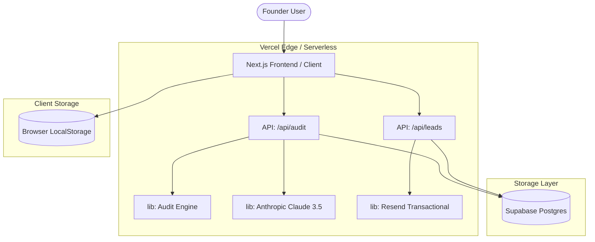

# System Architecture — AI Spend Audit Tool

## Overview
The AI Spend Audit Tool is a high-performance lead generation web application built on Next.js 14. It enables startup founders to audit their AI subscription costs and receive immediate, actionable savings recommendations.

## System Diagram

## Data Flow
1.  **Input Collection:** Users input their tool stack into a React form. State is persisted in `localStorage` to prevent data loss on refresh.
2.  **Audit Execution:**
    *   Client sends payload to `/api/audit`.
    *   **Audit Engine:** A deterministic pure-function library (`src/lib/audit.ts`) calculates savings based on team size vs plans.
    *   **AI Synthesis:** If configured, the Anthropic API generates a personalized summary paragraph.
    *   **Persistence:** The audit result is stored in Supabase under a unique UUID.
3.  **Lead Capture:**
    *   User views the report and submits their email.
    *   The `/api/leads` route updates the existing audit record and triggers a "Welcome/Report" email via Resend.
4.  **Sharing:** Each audit has a unique UUID-based URL (`/audit/[id]`), which pulls public-safe data (no user identifiable info) from Supabase.

## Stack Justification
-   **Next.js 14 (App Router):** Chosen for SEO benefits (Server Components) and rapid development of full-stack API routes.
-   **Tailwind CSS:** Enables a cohesive "Linear-style" glassmorphic UI with zero runtime overhead.
-   **Supabase:** Provides an instant Postgres backend with Row Level Security (RLS) for public sharing.
-   **Anthropic Claude 3.5 Sonnet:** Superior reasoning for generating professional financial summaries compared to GPT-4o.
-   **Resend:** Modern developer experience for transactional emails with high deliverability.

## Scaling Notes
To support **10,000+ audits per day**:
-   **Redis Caching:** Introduce Upstash Redis to cache audit results for the shareable URLs to reduce Supabase read load.
-   **Vercel Edge Functions:** Move API routes to the Edge runtime for lower latency globally.
-   **Rate Limiting:** Implement strict IP-based rate limiting on `/api/audit` to prevent AI budget exhaustion.
-   **Postgres Optimization:** Adding indexes on `audit_id` (already implemented) and potentially moving `tools_input` to a normalized structure for aggregate analytics.
